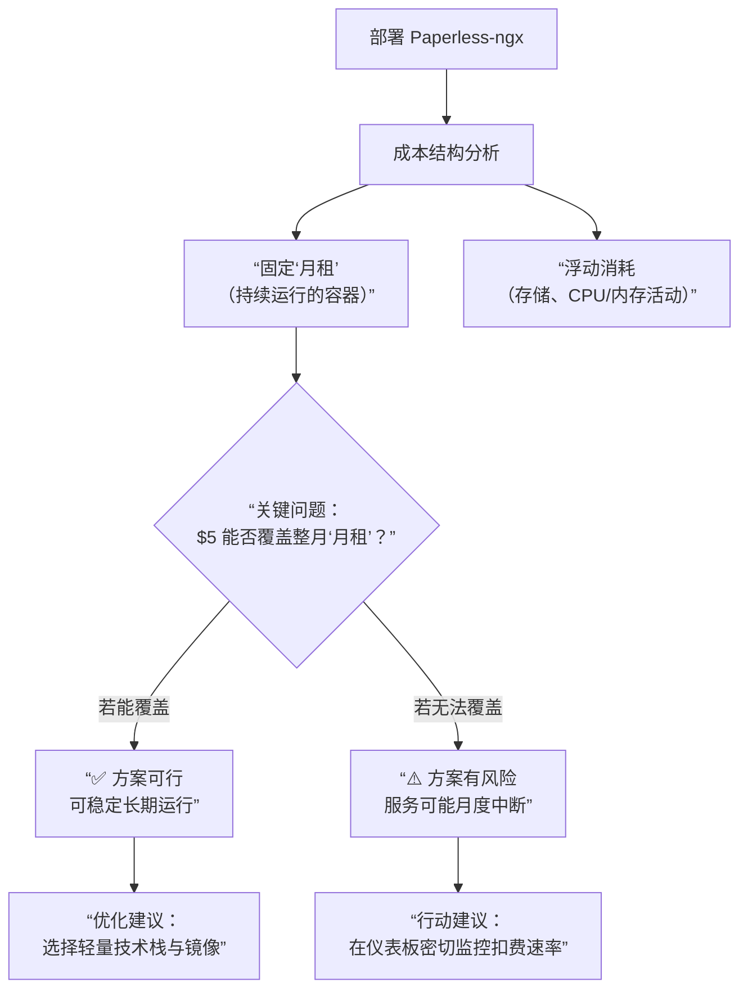

# keep-alive

## 主要内容

### 保活心跳监测

Render 免费服务器保活心跳监测

* 计划任务调度：cron-job.org
* 站点实时监测：UptimeRobot
* 自动保持仓库活动，避免定时任务暂停： keepalive-workflow

### Action 触发频率比对

频率超限问题


频率效果问题


## 其他

### run.claw.cloud

部署 Paperless，偶尔存点东西，存放不方便存于网盘的文件的，较长期私人共享的文件。



### Render

预估 https://memos-stable-e4bk.onrender.com 使用频率：每月3次，每次文字1k，图片总数及总和大小3M
* 实际月消耗：8-12 MB，用完时间：66-100个月，约：5.5-8.3年

```
✅ 包含内容：
- 静态站点：完全免费，无限制
- Web 服务：1个免费实例

📊 规格限制：
- CPU：共享，0.1-0.25核
- 内存：512 MB RAM
- 磁盘：1 GB 持久存储
- 带宽：100 GB/月出口流量

⏰ 休眠策略：
- 15分钟无流量 → 开始准备休眠
- 30分钟无流量 → 完全休眠
- 下次访问 → 冷启动（30-60秒）

⚠️ 注意：90天无活动可能被删除
```

因此，还是使用 github-twitter + github-blogger 或 cloudflare 部署 memos 高频率发文。
