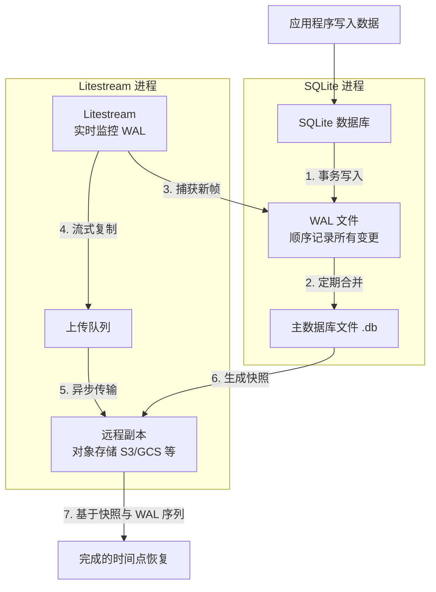

# keep-alive

## 主要内容

> [!note]
> 免费服务器最关键的一点就是限制持久存储与备份作业，想利用shell来操作文件实现备份都不可行。
> 尝试以下可行方案：
> * https://github.com/hu3rror/memos-on-fly
> * https://github.com/hu3rror/memos-litestream
> * [serverless 搭建 memos](https://blog.hoochanlon.moe/posts/20251216121833/) + [CF-Proxy-B2](https://github.com/hoochanlon/CF-Proxy-B2)


### 保活心跳监测

Render 免费服务器保活心跳监测。

* 计划任务调度：cron-job.org
* 站点实时监测：UptimeRobot
* 自动保持仓库活动，避免定时任务暂停： keepalive-workflow

### Action 触发频率比对

频率超限问题


频率效果问题


## 相关内容

### Render

预估 https://memos-stable-e4bk.onrender.com 使用频率：每月3次，每次文字1k，图片总数及总和大小3M
* 实际月消耗：8-12 MB，用完时间：66-100个月，约：5.5-8.3年

```
✅ 包含内容：
- 静态站点：完全免费，无限制
- Web 服务：1个免费实例

📊 规格限制：
- CPU：共享，0.1-0.25核
- 内存：512 MB RAM
- 磁盘：1 GB 持久存储
- 带宽：100 GB/月出口流量

⏰ 休眠策略：
- 15分钟无流量 → 开始准备休眠
- 30分钟无流量 → 完全休眠
- 下次访问 → 冷启动（30-60秒）

⚠️ 注意：90天无活动可能被删除
```

因此，还是使用 github-twitter + github-blogger 或 cloudflare 部署 memos 高频率发文。


### zeabur

免费：1 CPU，2G 内存，每月5美元重置，硬盘 $0.2/GB 月，网络输出费用 $0.1/GB

* 详情见：https://zeabur.com/docs/zh-CN/billing/pricing 。
* 或用 B2 S3 提供存储数据支撑 [tenten - 比較 Cloudflare R2 與 AWS S3，Blaze B2](https://university.tenten.co/t/cloudflare-r2-aws-s3-blaze-b2/1641)

采用 [hu3rror/memos-litestream](https://github.com/hu3rror/memos-litestream) 该方案，并结合 B2，既能满足可用存储充足，又能将个人账号基础数据备份，以及使用 [hoochanlon/CF-Proxy-B2](https://github.com/hoochanlon/CF-Proxy-B2) 达到免流目的。

Litestream 备份流程，解决了 serverless 备份限制的痛点



### run.claw.cloud

更适合搭测试微服务，不太适合折腾学习，更谈不上持久存储了。

* 免费账号每个月需要登录一次
* 最多 4 个虚拟 CPU / 8GB 内存
* 10GB 磁盘空间和流量限制
* 1 个工作区/可用区
* 终端只是 Kubernetes 容器，不具备完整的 VPS 功能

```
传统 VPS：            ⚙️👨💻
你管理：OS + 运行时 + 代码

容器/K8s：            ⚙️👨💻  
你管理：运行时 + 代码
平台管：OS + 虚拟化

Serverless：          👨💻
你只写：代码
平台管：一切基础设施
```


